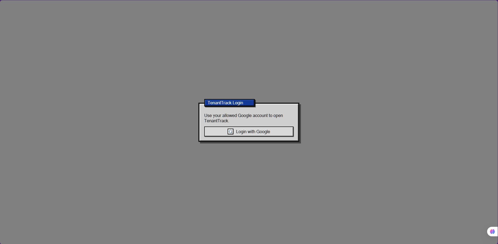
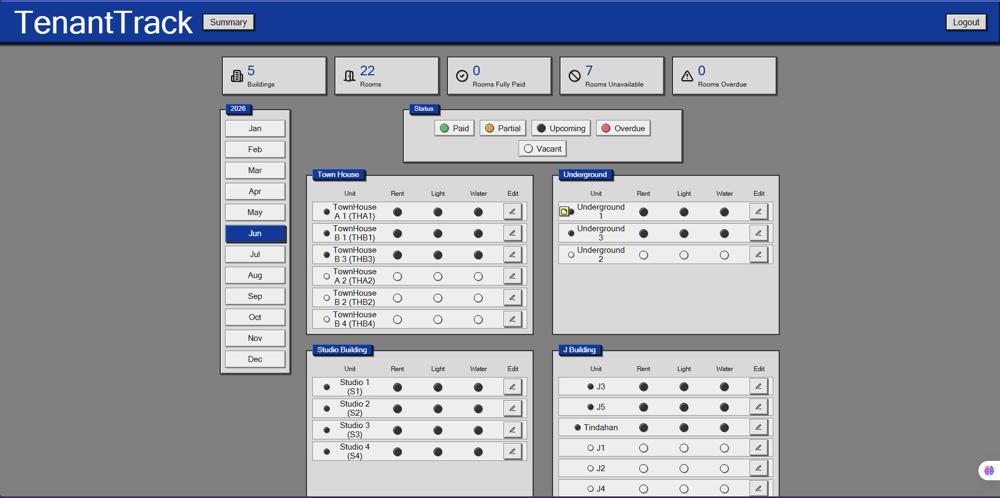
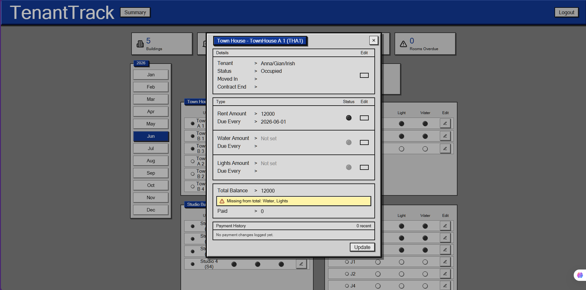
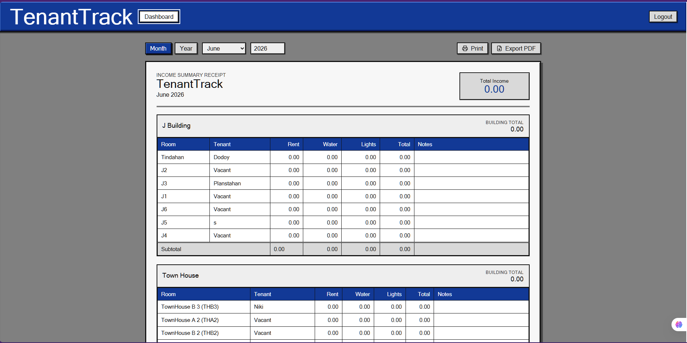
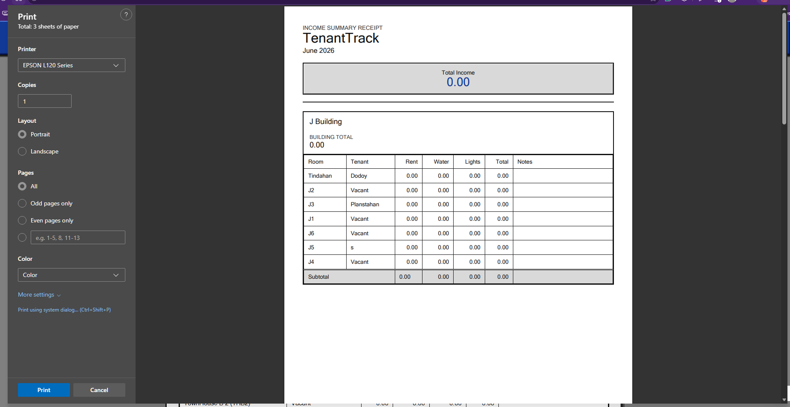

# TenantTrack

TenantTrack is a web-based property management and rent monitoring dashboard for landlords managing multiple buildings, rooms, tenants, and monthly payments.

The app provides a compact Windows-inspired dashboard for scanning rent, water, and electricity status by room. It also includes tenant/contract editing, payment updates, payment history logs, monthly notes, income summary receipts, receipt printing, and PDF export through the browser print flow.

## Tech Stack

| Area | Technology |
| --- | --- |
| Frontend | React 18 |
| Build tool | Vite 5 |
| Styling | Plain CSS modules imported from `src/styles/index.css` |
| Backend/database | Supabase Postgres |
| Auth | Supabase Auth with Google OAuth |
| Icons | `lucide-react` |
| Linting | ESLint 9 |

Main runtime dependencies:

- `react`
- `react-dom`
- `@supabase/supabase-js`
- `lucide-react`

## Features

- Google login with an `allowed_users` access list.
- Building and room dashboard with occupancy and payment indicators.
- Month selector for viewing payment status by billing period.
- Room edit modal for tenant details, rent, utility amounts, due dates, and payment status.
- Payment history log for changes to rent, water, and lights.
- Monthly notes for buildings and rooms, backed by Supabase with browser `localStorage` as a cache fallback.
- Income Summary Receipt view with month/year totals.
- Print receipt and Export PDF actions.

## Screenshots

Screenshots are stored in `docs/screenshots/`.











## Project Structure

```text
TenantTrack/
  docs/
    screenshots/
      dashboard.png
      income-summary.png
      login.png
      print-preview.png
      room-editor.png
  src/
    components/
      auth/
        AccessDeniedScreen.jsx
        LoginScreen.jsx
      notes/
        MonthlyNotesPanel.jsx
      room/
        DetailLine.jsx
        EditRoomWindow.jsx
        MoneyChangeConfirmation.jsx
        PaymentActionPanel.jsx
        PaymentBlock.jsx
        PaymentHistoryLog.jsx
        StatusSelectLine.jsx
      summary/
        SummaryPage.jsx
      BuildingCard.jsx
      DashboardStats.jsx
      StatusLegend.jsx
      UpdateNoticeDialog.jsx
    constants/
      appConstants.js
    functions/
      date.js
      formatters.js
      notes.js
      paymentAmounts.js
      paymentHistory.js
      paymentNotices.js
      paymentSchedule.js
      paymentStatus.js
      payments.js
      properties.js
      rooms.js
      summary.js
    lib/
      supabaseClient.js
    services/
      authService.js
      contractService.js
      monthlyNotesService.js
      paymentHistoryService.js
      paymentWriteService.js
      portfolioService.js
      roomService.js
      tenantService.js
    App.jsx
    main.jsx
    styles/
      auth.css
      base.css
      dashboard.css
      dialogs-and-room-editor.css
      index.css
      responsive-and-print.css
      summaries-and-notes.css
  .env.example
  monthly_notes.sql
  payment_history_logs.sql
  index.html
  package.json
  README.md
  tests/
```

Folder intent:

- `components/` contains React UI. Feature folders hold larger screens or workflows.
- `functions/` contains pure business logic and formatting helpers.
- `services/` contains Supabase reads and writes grouped by backend concern.
- `styles/` contains ordered CSS sections imported by `styles/index.css`.
- `constants/` contains shared labels, keys, and payment configuration.

## Requirements

- Node.js 18 or newer.
- npm.
- A Supabase project.
- A Google OAuth provider configured in Supabase Auth.

## Local Setup

1. Install dependencies.

```bash
npm install
```

2. Create a local environment file.

Copy `.env.example` to `.env.local` or `.env`, then fill in your Supabase values:

```env
VITE_SUPABASE_URL=your-supabase-project-url
VITE_SUPABASE_ANON_KEY=your-supabase-anon-key
```

3. Create and configure a Supabase project.

In Supabase, create a project and copy the Project URL and anon public key from:

```text
Project Settings -> API
```

4. Configure Google login in Supabase.

In Supabase, enable Google as an Auth provider:

```text
Authentication -> Providers -> Google
```

Add local and production redirect URLs in Supabase:

```text
http://localhost:5173
http://127.0.0.1:5173
your-production-url
```

5. Run the database schema.

Open the Supabase SQL Editor and run the schema in the `Database Schema` section below.

6. Add your allowed login email.

After creating the `allowed_users` table, insert each Google account that can use TenantTrack:

```sql
INSERT INTO public.allowed_users (email)
VALUES ('your-email@example.com');
```

7. Run helper SQL files if needed.

The repository includes `monthly_notes.sql` and `payment_history_logs.sql`. Run them in the Supabase SQL Editor if the app shows notes or payment history setup warnings.

8. Start the dev server.

```bash
npm run dev
```

The app runs at:

```text
http://localhost:5173
```

## Available Scripts

```bash
npm run dev
```

Starts the Vite development server.

```bash
npm run build
```

Creates a production build in `dist/`.

```bash
npm run preview
```

Serves the production build locally.

```bash
npm run lint
```

Runs ESLint.

```bash
npm run test
```

Runs the Node test suite for pure business logic.

## Supabase Setup Notes

TenantTrack reads from and writes to these tables:

- `buildings`
- `rooms`
- `tenants`
- `lease_contracts`
- `rent_payments`
- `utility_payments`
- `monthly_notes`
- `allowed_users`
- `payment_history_logs`

Monthly notes are read from and written to `monthly_notes`. The app also caches notes in browser `localStorage` using the key `tenanttrack.monthlyNotes.v1` so the UI can preserve note text locally if the notes table or policies need setup.

For development, the policies below are intentionally broad. Before production, replace them with policies scoped to authenticated landlord accounts.

## Database Schema

```sql
CREATE TABLE public.buildings (
  id uuid NOT NULL DEFAULT gen_random_uuid(),
  name text NOT NULL,
  address text,
  created_at timestamp without time zone DEFAULT now(),
  CONSTRAINT buildings_pkey PRIMARY KEY (id)
);

CREATE TABLE public.rooms (
  id uuid NOT NULL DEFAULT gen_random_uuid(),
  building_id uuid,
  room_name text NOT NULL,
  monthly_rent numeric,
  status text DEFAULT 'available'::text CHECK (
    status = ANY (ARRAY['available'::text, 'occupied'::text, 'unavailable'::text])
  ),
  created_at timestamp without time zone DEFAULT now(),
  CONSTRAINT rooms_pkey PRIMARY KEY (id),
  CONSTRAINT rooms_building_id_fkey FOREIGN KEY (building_id) REFERENCES public.buildings(id)
);

CREATE TABLE public.tenants (
  id uuid NOT NULL DEFAULT gen_random_uuid(),
  full_name text NOT NULL,
  contact_number text,
  created_at timestamp without time zone DEFAULT now(),
  CONSTRAINT tenants_pkey PRIMARY KEY (id)
);

CREATE TABLE public.lease_contracts (
  id uuid NOT NULL DEFAULT gen_random_uuid(),
  tenant_id uuid,
  room_id uuid,
  start_date date,
  end_date date,
  due_day integer,
  deposit numeric,
  advance_payment numeric,
  status text DEFAULT 'active'::text CHECK (
    status = ANY (ARRAY['active'::text, 'ended'::text, 'cancelled'::text])
  ),
  CONSTRAINT lease_contracts_pkey PRIMARY KEY (id),
  CONSTRAINT lease_contracts_tenant_id_fkey FOREIGN KEY (tenant_id) REFERENCES public.tenants(id),
  CONSTRAINT lease_contracts_room_id_fkey FOREIGN KEY (room_id) REFERENCES public.rooms(id)
);

CREATE TABLE public.rent_payments (
  id uuid NOT NULL DEFAULT gen_random_uuid(),
  contract_id uuid,
  billing_month integer,
  billing_year integer,
  amount_due numeric,
  amount_paid numeric,
  due_date date,
  payment_date date,
  status text CHECK (
    status = ANY (ARRAY['paid'::text, 'upcoming'::text, 'overdue'::text, 'partial'::text])
  ),
  CONSTRAINT rent_payments_pkey PRIMARY KEY (id),
  CONSTRAINT rent_payments_contract_id_fkey FOREIGN KEY (contract_id) REFERENCES public.lease_contracts(id),
  CONSTRAINT unique_rent_billing UNIQUE (contract_id, billing_month, billing_year)
);

CREATE TABLE public.utility_payments (
  id uuid NOT NULL DEFAULT gen_random_uuid(),
  contract_id uuid,
  utility_type text CHECK (
    utility_type = ANY (ARRAY['water'::text, 'electricity'::text])
  ),
  amount_due numeric,
  amount_paid numeric,
  due_date date,
  payment_date date,
  status text CHECK (
    status = ANY (ARRAY['paid'::text, 'upcoming'::text, 'overdue'::text, 'partial'::text])
  ),
  billing_month integer,
  billing_year integer,
  CONSTRAINT utility_payments_pkey PRIMARY KEY (id),
  CONSTRAINT utility_payments_contract_id_fkey FOREIGN KEY (contract_id) REFERENCES public.lease_contracts(id),
  CONSTRAINT unique_utility_billing UNIQUE (
    contract_id,
    utility_type,
    billing_month,
    billing_year
  )
);

CREATE TABLE public.monthly_notes (
  id uuid NOT NULL DEFAULT gen_random_uuid(),
  scope text NOT NULL CHECK (
    scope = ANY (ARRAY['building'::text, 'room'::text])
  ),
  target_id uuid NOT NULL,
  billing_month integer NOT NULL,
  billing_year integer NOT NULL,
  note text DEFAULT ''::text,
  updated_at timestamp without time zone DEFAULT now(),
  CONSTRAINT monthly_notes_pkey PRIMARY KEY (id),
  CONSTRAINT unique_monthly_note UNIQUE (
    scope,
    target_id,
    billing_month,
    billing_year
  )
);

CREATE TABLE public.allowed_users (
  email text NOT NULL,
  CONSTRAINT allowed_users_pkey PRIMARY KEY (email)
);

CREATE TABLE public.payment_history_logs (
  id uuid NOT NULL DEFAULT gen_random_uuid(),
  room_id uuid,
  contract_id uuid,
  payment_table text NOT NULL CHECK (
    payment_table = ANY (ARRAY['rent_payments'::text, 'utility_payments'::text])
  ),
  payment_id uuid,
  payment_type text NOT NULL CHECK (
    payment_type = ANY (ARRAY['rent'::text, 'water'::text, 'light'::text])
  ),
  utility_type text,
  billing_month integer,
  billing_year integer,
  old_amount_paid numeric DEFAULT 0,
  new_amount_paid numeric DEFAULT 0,
  old_status text,
  new_status text,
  changed_by text,
  created_at timestamp without time zone DEFAULT now(),
  CONSTRAINT payment_history_logs_pkey PRIMARY KEY (id),
  CONSTRAINT payment_history_logs_room_id_fkey FOREIGN KEY (room_id) REFERENCES public.rooms(id),
  CONSTRAINT payment_history_logs_contract_id_fkey FOREIGN KEY (contract_id) REFERENCES public.lease_contracts(id)
);
```

## Development RLS Policies

Enable RLS:

```sql
ALTER TABLE public.buildings ENABLE ROW LEVEL SECURITY;
ALTER TABLE public.rooms ENABLE ROW LEVEL SECURITY;
ALTER TABLE public.tenants ENABLE ROW LEVEL SECURITY;
ALTER TABLE public.lease_contracts ENABLE ROW LEVEL SECURITY;
ALTER TABLE public.rent_payments ENABLE ROW LEVEL SECURITY;
ALTER TABLE public.utility_payments ENABLE ROW LEVEL SECURITY;
ALTER TABLE public.monthly_notes ENABLE ROW LEVEL SECURITY;
ALTER TABLE public.allowed_users ENABLE ROW LEVEL SECURITY;
ALTER TABLE public.payment_history_logs ENABLE ROW LEVEL SECURITY;
```

Read policies:

```sql
CREATE POLICY "Allow read buildings"
ON public.buildings FOR SELECT
TO anon, authenticated
USING (true);

CREATE POLICY "Allow read rooms"
ON public.rooms FOR SELECT
TO anon, authenticated
USING (true);

CREATE POLICY "Allow read tenants"
ON public.tenants FOR SELECT
TO anon, authenticated
USING (true);

CREATE POLICY "Allow read lease contracts"
ON public.lease_contracts FOR SELECT
TO anon, authenticated
USING (true);

CREATE POLICY "Allow read rent payments"
ON public.rent_payments FOR SELECT
TO anon, authenticated
USING (true);

CREATE POLICY "Allow read utility payments"
ON public.utility_payments FOR SELECT
TO anon, authenticated
USING (true);

CREATE POLICY "Allow read monthly notes"
ON public.monthly_notes FOR SELECT
TO anon, authenticated
USING (true);

CREATE POLICY "Allow read allowed users"
ON public.allowed_users FOR SELECT
TO anon, authenticated
USING (true);

CREATE POLICY "Allow read payment history logs"
ON public.payment_history_logs FOR SELECT
TO anon, authenticated
USING (true);
```

Write policies for development:

```sql
CREATE POLICY "Allow update rooms"
ON public.rooms FOR UPDATE
TO anon, authenticated
USING (true)
WITH CHECK (true);

CREATE POLICY "Allow update tenants"
ON public.tenants FOR UPDATE
TO anon, authenticated
USING (true)
WITH CHECK (true);

CREATE POLICY "Allow insert tenants"
ON public.tenants FOR INSERT
TO anon, authenticated
WITH CHECK (true);

CREATE POLICY "Allow update lease contracts"
ON public.lease_contracts FOR UPDATE
TO anon, authenticated
USING (true)
WITH CHECK (true);

CREATE POLICY "Allow insert lease contracts"
ON public.lease_contracts FOR INSERT
TO anon, authenticated
WITH CHECK (true);

CREATE POLICY "Allow update rent payments"
ON public.rent_payments FOR UPDATE
TO anon, authenticated
USING (true)
WITH CHECK (true);

CREATE POLICY "Allow insert rent payments"
ON public.rent_payments FOR INSERT
TO anon, authenticated
WITH CHECK (true);

CREATE POLICY "Allow delete rent payments"
ON public.rent_payments FOR DELETE
TO anon, authenticated
USING (true);

CREATE POLICY "Allow update utility payments"
ON public.utility_payments FOR UPDATE
TO anon, authenticated
USING (true)
WITH CHECK (true);

CREATE POLICY "Allow insert utility payments"
ON public.utility_payments FOR INSERT
TO anon, authenticated
WITH CHECK (true);

CREATE POLICY "Allow delete utility payments"
ON public.utility_payments FOR DELETE
TO anon, authenticated
USING (true);

CREATE POLICY "Allow insert monthly notes"
ON public.monthly_notes FOR INSERT
TO anon, authenticated
WITH CHECK (true);

CREATE POLICY "Allow update monthly notes"
ON public.monthly_notes FOR UPDATE
TO anon, authenticated
USING (true)
WITH CHECK (true);

CREATE POLICY "Allow insert payment history logs"
ON public.payment_history_logs FOR INSERT
TO anon, authenticated
WITH CHECK (true);
```

## Production RLS Direction

For production, prefer authenticated-only policies tied to the `allowed_users` table. This keeps the frontend access gate and database access rules aligned:

```sql
CREATE OR REPLACE FUNCTION public.is_allowed_user()
RETURNS boolean
LANGUAGE sql
STABLE
SECURITY DEFINER
SET search_path = public
AS $$
  SELECT EXISTS (
    SELECT 1
    FROM public.allowed_users
    WHERE lower(email) = lower(auth.jwt() ->> 'email')
  );
$$;

CREATE POLICY "Allowed users can read buildings"
ON public.buildings FOR SELECT
TO authenticated
USING (public.is_allowed_user());

CREATE POLICY "Allowed users can update rooms"
ON public.rooms FOR UPDATE
TO authenticated
USING (public.is_allowed_user())
WITH CHECK (public.is_allowed_user());

CREATE POLICY "Allowed users can upsert monthly notes"
ON public.monthly_notes FOR INSERT
TO authenticated
WITH CHECK (public.is_allowed_user());

CREATE POLICY "Allowed users can update monthly notes"
ON public.monthly_notes FOR UPDATE
TO authenticated
USING (public.is_allowed_user())
WITH CHECK (public.is_allowed_user());
```

Apply the same `public.is_allowed_user()` pattern to the rest of the tables that TenantTrack reads or writes, and avoid granting production table access to `anon`.

## Seed Data Example

Use this as a minimal smoke test after creating the schema:

```sql
INSERT INTO public.buildings (name, address)
VALUES ('Sample Building', '123 Demo Street')
RETURNING id;
```

Then create rooms using the returned building id:

```sql
INSERT INTO public.rooms (building_id, room_name, monthly_rent, status)
VALUES
  ('replace-with-building-id', '101', 5500, 'available'),
  ('replace-with-building-id', '102', 6000, 'available');
```

## Receipt Print and PDF Export

The Summary page has two receipt actions:

- `Print` opens the browser print dialog.
- `Export PDF` opens the same print dialog with a PDF-friendly document title. Choose `Save as PDF` as the destination.

The receipt print layout is controlled by the `@media print` rules in `src/styles/responsive-and-print.css`.

## Deployment Notes

1. Build the app with `npm run build`.
2. Deploy the generated `dist/` folder to a static host.
3. Add the production URL to Supabase Auth redirect URLs.
4. Configure production environment variables:

```env
VITE_SUPABASE_URL=your-supabase-project-url
VITE_SUPABASE_ANON_KEY=your-supabase-anon-key
```

5. Replace broad development RLS policies with production policies tied to authenticated landlord accounts.

## Troubleshooting

If the app says Supabase environment variables are missing, confirm `.env.local` or `.env` exists and restart `npm run dev`.

If login succeeds but access is denied, add the signed-in Google email to `public.allowed_users`.

If payment history shows a setup warning, run `payment_history_logs.sql` in the Supabase SQL Editor.

If saving a rent payment fails with `violates check constraint "rent_status_check"`, update the Supabase check constraint so it allows the app's payment statuses:

```sql
ALTER TABLE public.rent_payments
DROP CONSTRAINT IF EXISTS rent_status_check;

ALTER TABLE public.rent_payments
ADD CONSTRAINT rent_status_check
CHECK (status = ANY (ARRAY['paid'::text, 'upcoming'::text, 'overdue'::text, 'partial'::text]));
```

Apply the same idea to `utility_payments` if your utility status constraint has a different allowed list.

If the receipt PDF does not download directly, use the browser print dialog and select `Save as PDF`.
